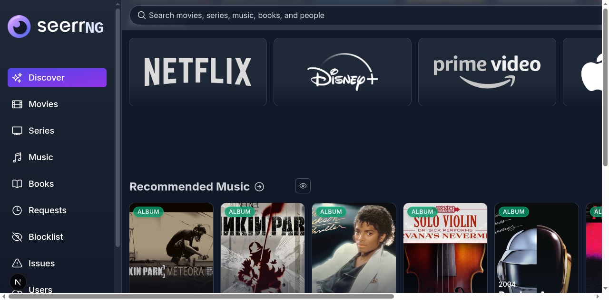
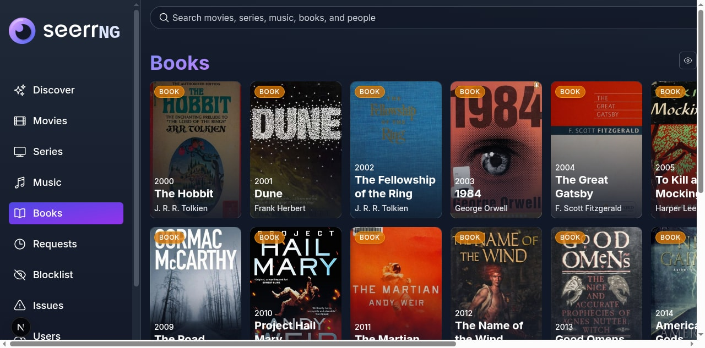
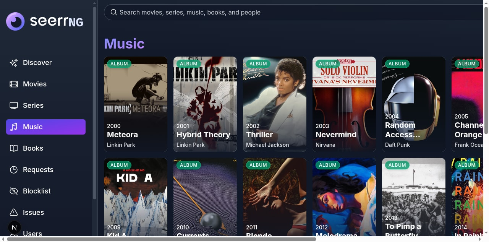

<p align="center">
  
</p>

<p align="center">
  
  <a href="https://github.com/snapetech/seerrng/blob/main/LICENSE"></a>
  <a href="https://discord.gg/2N42G4RJCU"></a>
</p>

# SeerrNG

SeerrNG is a self-hosted request and discovery app for personal media libraries. It extends the Seerr/Jellyseerr/Overseerr lineage beyond movies and TV into music, ebooks, and audiobooks while keeping the familiar request approval workflow for Plex, Jellyfin, Emby, Radarr, and Sonarr users.

This fork is maintained by snapetech. Upstream Seerr remains the base project for inherited video, user, server, and deployment behavior; SeerrNG-specific work focuses on multi-format media requests, service routing, caching, and fork-owned packaging/docs. See [NOTICE.md](./NOTICE.md) for attribution rules.

## What SeerrNG Does

- Requests and approvals for movies, shows, music, ebooks, audiobooks, and combined ebook/audiobook book requests.
- Media-server integration with Plex, Jellyfin, and Emby.
- Automation service integration with Radarr, Sonarr, Lidarr, and Bookshelf/Readarr-compatible APIs.
- Music discovery and metadata through MusicBrainz, ListenBrainz, Cover Art Archive, TheAudioDB, and archive-backed artwork sources.
- Book discovery and identity matching through Open Library, ISBN-10/ISBN-13 normalization, foreign book IDs, and edition IDs.
- Separate ebook and audiobook service routing so both formats can be requested, approved, scanned, retried, and removed independently.
- Watchlists, blocklists, request quotas, override rules, permissions, notifications, issue reporting, and request management.
- Browser, service-worker, API, DNS, avatar, and image-proxy caching tuned for faster refreshes and tab restores.

## Project Status

SeerrNG is active fork work. Movie and TV behavior is inherited and generally stable. Music and book support is usable but should still be treated as evolving, especially around provider matching and real-world Bookshelf/Readarr edge cases.

Current focus:

- Stabilizing Lidarr request, scan, retry, and removal flows.
- Stabilizing Bookshelf ebook, audiobook, and both-format request flows.
- Keeping image/API caching fast without blocking the visible page during refreshes.
- Replacing upstream branding and docs with SeerrNG-owned assets and guidance.
- Hardening request validation, notification settings, permission bounds, and service inputs.

## Screenshots

### Discover



### Books



### Music



## Install

### Docker

The main container image is published from this repository:

```bash
docker run -d \
  --name seerrng \
  -e LOG_LEVEL=info \
  -e PORT=5055 \
  -p 5055:5055 \
  -v /path/to/seerrng/config:/app/config \
  --restart unless-stopped \
  ghcr.io/snapetech/seerrng:main
```

Open `http://localhost:5055` and complete setup.

### Docker Compose

```yaml
services:
  seerrng:
    image: ghcr.io/snapetech/seerrng:main
    container_name: seerrng
    environment:
      LOG_LEVEL: info
      PORT: 5055
      TMDB_API_KEY: ${TMDB_API_KEY}
      TMDB_READ_ACCESS_TOKEN: ${TMDB_READ_ACCESS_TOKEN}
    ports:
      - 5055:5055
    volumes:
      - /path/to/seerrng/config:/app/config
    restart: unless-stopped
```

### Linux Packages

This repo includes release workflows and packaging metadata for tarball, Debian, RPM, AppImage, Flatpak, Snap, AUR, PPA, and COPR style distribution. Use the GitHub releases for generated artifacts when available.

## Required Setup

SeerrNG needs the same base setup as Seerr for video libraries, plus optional services for music and books.

Core:

- A Plex, Jellyfin, or Emby server.
- Radarr for movie automation.
- Sonarr for TV automation.
- SQLite or PostgreSQL for the application database.

Music:

- Lidarr server configured in **Settings > Services**.
- Root folder, quality profile, metadata profile, and tags configured from the Lidarr service settings.
- A default Lidarr server if users should be able to request music without choosing a service each time.

Books:

- Bookshelf or another Readarr-compatible service configured in **Settings > Services**.
- One service marked as ebook-capable for ebook requests.
- Optional second service marked as audiobook-capable for audiobook requests.
- Separate defaults for ebook and audiobook if both-format requests should work cleanly.

## Environment Variables

Common runtime variables:

| Variable | Purpose |
| --- | --- |
| `PORT` | HTTP port. Defaults to `5055`. |
| `LOG_LEVEL` | Server log level. |
| `CONFIG_DIRECTORY` | Alternate config directory for non-container installs. |
| `TMDB_API_KEY` | TMDB v3 API key. |
| `TMDB_READ_ACCESS_TOKEN` | TMDB v4 bearer token. |
| `SEERR_EXTERNAL_READ_ONLY` | Blocks mutating requests to external automation APIs when enabled. Useful for test/lab environments. |

Use deployment secrets, `.env` files, or container environment variables. Do not commit private TMDB, Plex, Jellyfin, Emby, Radarr, Sonarr, Lidarr, Bookshelf, SMTP, or notification credentials.

## Caching and Performance

SeerrNG has several cache layers. They are designed to make repeat browsing, page refreshes, and tab restores fast while keeping media data reasonably fresh.

- **Service worker runtime cache** keeps cacheable API responses, static assets, avatars, and image proxy responses available to the browser.
- **Stale-while-revalidate API responses** let cacheable pages populate quickly while background requests refresh data.
- **Image proxy cache** stores supported external images under the config cache directory and returns browser validators for efficient `304 Not Modified` responses.
- **Visible-first warmup** warms images for visible titles before below-the-fold content.
- **Hidden-tab restraint** skips image warmup while the tab is hidden so returning to the tab does not flood the app with stale work.
- **Host caches** cover TMDB, MusicBrainz, ListenBrainz, Open Library, Cover Art Archive, TheAudioDB, Radarr, Sonarr, Lidarr, Readarr/Bookshelf, DNS, and image metadata where supported.
- **Jobs & Cache settings** expose cache stats and flush controls.

If SeerrNG runs behind a reverse proxy, do not blanket-strip cache headers or force `Cache-Control: no-store` on `/imageproxy/*`, `/avatarproxy/*`, `/sw.js`, static assets, or cacheable API responses. App pages and sensitive routes can remain non-cacheable.

## Development

Requirements:

- Node.js matching the repo/tooling version.
- `pnpm`.
- SQLite for local development, or PostgreSQL if testing that backend.

Install dependencies:

```bash
pnpm install
```

Run the development server:

```bash
pnpm dev
```

Useful commands:

```bash
pnpm typecheck
pnpm typecheck:client
pnpm typecheck:server
pnpm lint
pnpm test
pnpm build
pnpm --dir gen-docs build
```

API docs are served by a running local install at:

```text
http://localhost:5055/api-docs
```

## Testing Real Integrations

For music and book changes, test against real services when possible:

- Add a Lidarr server, set it as default, request an album, approve it, scan it, retry failure cases, and remove it.
- Add a Bookshelf/Readarr-compatible ebook server, request a book by search result and specific edition/ISBN, approve it, scan it, retry it, and remove it.
- Add a separate audiobook Bookshelf service and test audiobook-only plus both-format requests.
- Confirm request cards, request detail pages, notifications, and backend links point to the correct SeerrNG and service pages.

See [docs/using-seerr/music-and-books-alpha.md](./docs/using-seerr/music-and-books-alpha.md) for the current hands-on test checklist.

## Legal Use

SeerrNG is intended for lawful personal media management. The project does not provide media, does not bypass DRM, and does not condone piracy or copyright infringement. Users are responsible for complying with the laws, licenses, and service terms that apply in their region.

## Support

- Discord: https://discord.gg/2N42G4RJCU
- Issues: https://github.com/snapetech/seerrng/issues
- Discussions: https://github.com/snapetech/seerrng/discussions

Use upstream Seerr documentation when you need background on inherited deployment or video-library behavior, but report SeerrNG-specific music, book, cache, packaging, and branding issues in this repository.

## Contributing

Contributions should target SeerrNG behavior and this repository's current branch layout. Before opening a pull request:

- Keep fork attribution intact.
- Avoid reintroducing upstream-only branding.
- Add or update tests for request, validation, service-routing, cache, and scanner behavior.
- Run the relevant typecheck/test commands.
- Disclose AI assistance as required by [CONTRIBUTING.md](./CONTRIBUTING.md).

## Attribution

SeerrNG builds on Seerr, Jellyseerr, and Overseerr. Inherited code, documentation, and design remain credited to their original contributors. Fork-specific changes are credited to snapetech and SeerrNG contributors unless otherwise noted. See [NOTICE.md](./NOTICE.md) for the full attribution policy.
