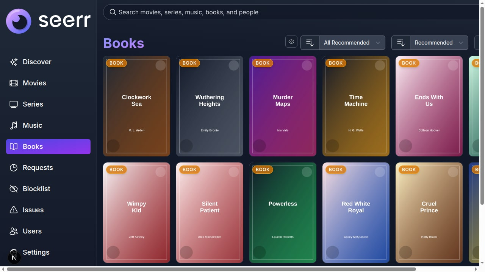
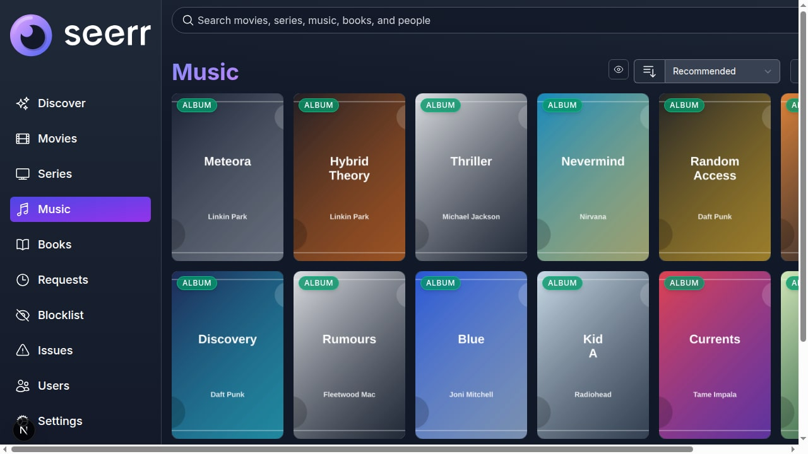

# SeerrNG

**SeerrNG** is a fork of [Seerr](https://github.com/seerr-team/seerr) focused on extending media requests beyond movies and TV into music, books, and related library automation.

SeerrNG is built on the work of the Seerr, Jellyseerr, and Overseerr projects. Upstream Seerr remains the base project and is credited for the original application, architecture, and ongoing video-first media request manager.

See [NOTICE.md](./NOTICE.md) for fork attribution and ownership guidance. In
short: inherited material remains credited to upstream contributors, modified
inherited material is co-attributed, and fresh SeerrNG-specific work is
attributed to snapetech and SeerrNG contributors unless another source is
stated.

The current inherited Seerr application is a free and open source software application for managing requests for your media library. It integrates with the media server of your choice: [Jellyfin](https://jellyfin.org), [Plex](https://plex.tv), and [Emby](https://emby.media/). In addition, it integrates with your existing services, such as **[Sonarr](https://sonarr.tv/)**, **[Radarr](https://radarr.video/)**.

## Fork Direction

SeerrNG is targeting first-class request and availability workflows for:

- Movies and TV via the inherited Radarr/Sonarr integrations.
- Music via Lidarr, MusicBrainz, ListenBrainz, and Cover Art Archive.
- Books via [Bookshelf](https://github.com/pennydreadful/bookshelf) (Readarr-compatible), Open Library/ISBN identifiers, and library backends where practical.

The implementation priority is to stabilize music first, then add books behind a clean identifier and format model instead of forcing everything through movie/TV-shaped IDs. Bookshelf is the recommended book automation backend; SeerrNG currently talks to it through the Readarr-compatible API surface so standard Readarr-compatible installs can still be tested.

## Legal Use

SeerrNG is intended for lawful personal media management. The project does not condone piracy or copyright infringement. Users are responsible for complying with the laws, licenses, and service terms that apply in their region.

## Current Features

- Full Jellyfin/Emby/Plex integration including authentication with user import & management.
- Support for **PostgreSQL** and **SQLite** databases.
- Supports Movies, Shows and Mixed Libraries.
- Ability to change email addresses for SMTP purposes.
- Easy integration with your existing services. Currently, Seerr supports Sonarr and Radarr. More to come!
- Jellyfin/Emby/Plex library scan, to keep track of the titles which are already available.
- Customizable request system, which allows users to request individual seasons or movies in a friendly, easy-to-use interface.
- Incredibly simple request management UI. Don't dig through the app to simply approve recent requests!
- Granular permission system.
- Support for various notification agents.
- Mobile-friendly design, for when you need to approve requests on the go!
- Support for watchlisting & blocklisting media.
- Browser and host-side caching for faster repeat loads, refreshes, and tab restores.
- Image proxy caching and cache warming for posters, backdrops, avatars, music artwork, and book covers.
- Service-worker runtime caching for cacheable API responses, static assets, and proxied images.

With more features on the way! Check out our [issue tracker](/../../issues) to see the features which have already been requested.

## Getting Started

Check out our documentation for instructions on how to install and run Seerr:

https://docs.seerr.dev/getting-started/

## TMDB Credentials

SeerrNG reads TMDB credentials from the environment:

- `TMDB_API_KEY`: TMDB API key (v3 auth).
- `TMDB_READ_ACCESS_TOKEN`: TMDB API read access token (v4 bearer token).

Use deployment secrets, `.env` files, or container environment variables for these values. Do not commit private deployment credentials to the repository.

## Performance and Caching

SeerrNG includes several cache layers intended to make refreshes, tab restores, and repeated browsing much faster while still keeping media data fresh:

- **Browser runtime cache**: the service worker registers independently of push notification setup and keeps a bounded `runtime-v1` cache for cacheable API responses, static assets, avatar proxy responses, and image proxy responses.
- **Stale-while-revalidate responses**: cacheable public/settings/discover/search/media API responses and proxied images can be served immediately from cache while SeerrNG refreshes them in the background.
- **Image proxy cache**: externally sourced images are proxied through SeerrNG, stored under the config cache directory when image caching is enabled, and returned with browser cache headers plus validators for efficient `304 Not Modified` responses.
- **Visible-first image warming**: media sliders warm only the currently visible titles first, cap warmup batches, dedupe repeated warm requests, and schedule warmup work during idle time so below-the-fold content does not block the first populated viewport.
- **Background-tab restraint**: browser image warming is skipped while the tab is hidden so switching away and back does not create unnecessary warmup traffic.
- **DNS and external API caches**: Jobs & Cache settings expose cache statistics and flush controls for external API, DNS, and image cache data.

When SeerrNG is behind a reverse proxy, avoid blanket `Cache-Control: no-store` on cacheable API, static asset, `/imageproxy/*`, `/avatarproxy/*`, and `/sw.js` paths. Protected app pages can remain non-cacheable, but stripping cache headers from the cacheable paths will prevent the browser and service worker from doing useful work.

## Preview

### Discover

### Books

### Music

## Migrating from Overseerr/Jellyseerr to Seerr

Read our [release announcement](https://docs.seerr.dev/blog/seerr-release) to learn what Seerr means for Jellyseerr and Overseerr users.

Please follow our [migration guide](https://docs.seerr.dev/migration-guide) for detailed instructions on migrating from Overseerr or Jellyseerr.

## Support

- Check out the [Seerr Documentation](https://docs.seerr.dev) before asking for help. Your question might already be in the docs!
- SeerrNG support is available on Discord in our community channel: https://discord.gg/2N42G4RJCU
- You can ask questions in the Help category of our [GitHub Discussions](/../../discussions).
- Bug reports and feature requests can be submitted via [GitHub Issues](/../../issues).

For SeerrNG-specific help, development discussion, tester feedback, and books/music workflow support, join our Discord channel at https://discord.gg/2N42G4RJCU. Upstream Seerr documentation remains useful for inherited video, server, and deployment behavior, but SeerrNG fork-specific support should start in our Discord.

## API Documentation

You can access the API documentation from your local Seerr install at http://localhost:5055/api-docs

## Community

You can ask questions, share ideas, and more in [GitHub Discussions](/../../discussions).

If you would like to chat with other members of our growing community, [join the SeerrNG Discord channel](https://discord.gg/2N42G4RJCU)!

Our [Code of Conduct](./CODE_OF_CONDUCT.md) applies to all Seerr community channels.

## Contributing

You can help improve Seerr too! Check out our [Contribution Guide](./CONTRIBUTING.md) to get started.

## Contributors ✨

