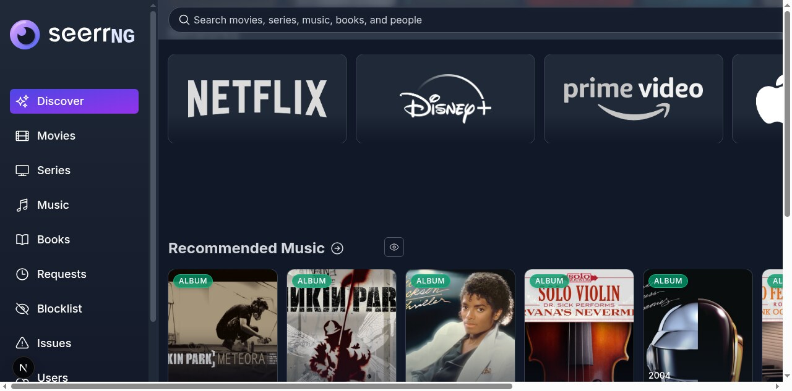

# SeerrNG

**SeerrNG** is a fork of [Seerr](https://github.com/seerr-team/seerr) focused on extending media requests beyond movies and TV into music, books, audiobooks, and related library automation.

SeerrNG is built on the work of the Seerr, Jellyseerr, and Overseerr projects. Upstream Seerr remains the base project and is credited for the original application, architecture, and ongoing video-first media request manager.

The current inherited Seerr application is a free and open source software application for managing requests for your media library. It integrates with the media server of your choice: [Jellyfin](https://jellyfin.org), [Plex](https://plex.tv), and [Emby](https://emby.media/). In addition, it integrates with your existing services, such as **[Sonarr](https://sonarr.tv/)**, **[Radarr](https://radarr.video/)**.

## Fork Direction

SeerrNG is targeting first-class request and availability workflows for:

- Movies and TV via the inherited Radarr/Sonarr integrations.
- Music via Lidarr, MusicBrainz, ListenBrainz, and Cover Art Archive.
- Books and audiobooks via Readarr, Hardcover/ISBN identifiers, and audiobook/library backends where practical.

The implementation priority is to stabilize music first, then add books behind a clean identifier and format model instead of forcing everything through movie/TV-shaped IDs.

## Legal Use

SeerrNG is intended for lawful personal media management. The project does not condone piracy or copyright infringement. Users are responsible for complying with the laws, licenses, and service terms that apply in their region.

## Current Features

- Full Jellyfin/Emby/Plex integration including authentication with user import & management.
- Support for **PostgreSQL** and **SQLite** databases.
- Supports Movies, Shows and Mixed Libraries.
- Ability to change email addresses for SMTP purposes.
- Easy integration with your existing services. Currently, Seerr supports Sonarr and Radarr. More to come!
- Jellyfin/Emby/Plex library scan, to keep track of the titles which are already available.
- Customizable request system, which allows users to request individual seasons or movies in a friendly, easy-to-use interface.
- Incredibly simple request management UI. Don't dig through the app to simply approve recent requests!
- Granular permission system.
- Support for various notification agents.
- Mobile-friendly design, for when you need to approve requests on the go!
- Support for watchlisting & blocklisting media.

With more features on the way! Check out our [issue tracker](/../../issues) to see the features which have already been requested.

## Getting Started

Check out our documentation for instructions on how to install and run Seerr:

https://docs.seerr.dev/getting-started/

## TMDB Credentials

SeerrNG reads TMDB credentials from the environment:

- `TMDB_API_KEY`: TMDB API key (v3 auth).
- `TMDB_READ_ACCESS_TOKEN`: TMDB API read access token (v4 bearer token).

Use deployment secrets, `.env` files, or container environment variables for these values. Do not commit private deployment credentials to the repository.

## Preview

## Migrating from Overseerr/Jellyseerr to Seerr

Read our [release announcement](https://docs.seerr.dev/blog/seerr-release) to learn what Seerr means for Jellyseerr and Overseerr users.

Please follow our [migration guide](https://docs.seerr.dev/migration-guide) for detailed instructions on migrating from Overseerr or Jellyseerr.

## Support

- Check out the [Seerr Documentation](https://docs.seerr.dev) before asking for help. Your question might already be in the docs!
- You can get support on [Discord](https://discord.gg/seerr).
- You can ask questions in the Help category of our [GitHub Discussions](/../../discussions).
- Bug reports and feature requests can be submitted via [GitHub Issues](/../../issues).

## API Documentation

You can access the API documentation from your local Seerr install at http://localhost:5055/api-docs

## Community

You can ask questions, share ideas, and more in [GitHub Discussions](/../../discussions).

If you would like to chat with other members of our growing community, [join the Seerr Discord server](https://discord.gg/seerr)!

Our [Code of Conduct](./CODE_OF_CONDUCT.md) applies to all Seerr community channels.

## Contributing

You can help improve Seerr too! Check out our [Contribution Guide](./CONTRIBUTING.md) to get started.

## Contributors ✨

